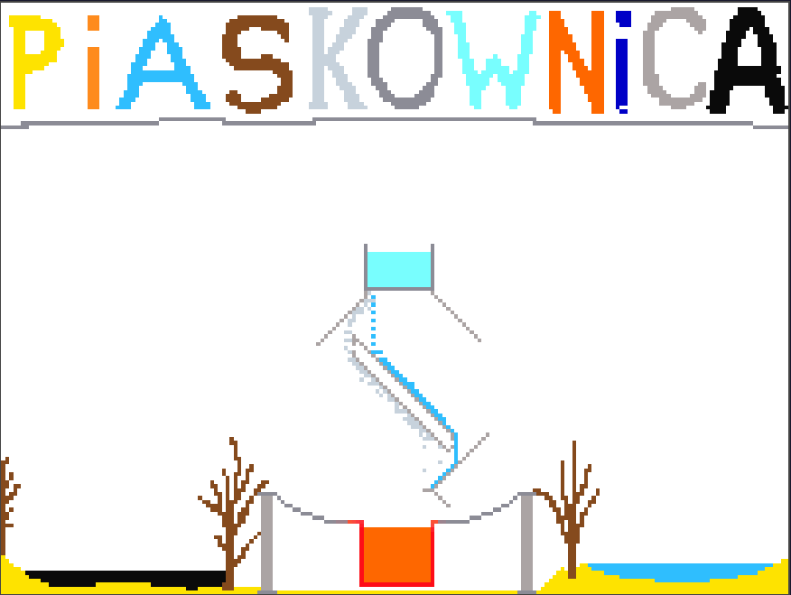

# https://a-hlebowicz.github.io/piaskownica/
 
[](README.md)
[](README.pl.md)
 


Falling-sand style particle simulation with heat propagation. Rust + WebAssembly, Canvas 2D.
 
Each cell is a particle with a type (sand, water, fire, etc.) and temperature. Particles fall, water spreads, fire expands, ice melts. Temperature propagates through neighbors according to the thermal conductivity of the given material. The user draws materials with the mouse.
 
## materials
 
- `Empty` - air, thermally insulates (does not exchange heat)
- `Sand` - falls, sinks in water and lava
- `Water` - falls and spreads; evaporates above 110°C, freezes below -10°C
- `Stone` - immovable, non-flammable
- `Wood` - immovable, ignites above 50°C
- `Fire` - rises chaotically, cools passively, extinguishes below 300°C
- `Ice` - immovable, melts above 10°C
- `Lava` - flows like water, freezes into stone below 800°C
- `Steam` - rises, condenses into water below 90°C
- `Metal` - immovable, conducts heat great; glows red when hot
- `Oil` - lighter than water, flammable
- `Cold` - cold counterpart of fire

Each material has a temperature (`i16`, °C) and `conductivity` (how willingly it exchanges heat).
 
## temperature physics
 
Air is treated as a thermal vacuum. Heat transfers only between touching materials. Lava poured in the air will not cool down by itself; it must be flooded with water or covered with sand.
 
Propagation through a weighted average of 8 neighbors (4 straight + 4 diagonals with weakened influence). Exchange is proportional to the temperature difference and the product of conductivity of both cells.
 
Transformations (water↔ice, water↔steam, lava→stone, wood→fire) are a separate step, performed after propagation. Water steam has hysteresis (110/90°C) to avoid oscillations.
 
Fire has built-in passive cooling - it loses 1-5°C/tick regardless of neighbors. Without fuel it extinguishes, with fuel it propagates in a chain reaction.
 
## stack
 
- Rust (core: simulation, physics, rendering to pixel buffer)
- `wasm-bindgen` + `wasm-pack` (compilation to WASM)
- Vanilla JavaScript (WASM loading, game loop, mouse handling, drawing on canvas)
- HTML5 Canvas 2D
- CSS generated by Claude

## architecture
 
The grid is a `Vec<Particle>` of size `width * height`, index `y * width + x`. The pixel buffer is a separate `Vec<u8>` (RGBA). JS reads the buffer directly from WASM memory through a pointer.
 
Each tick executes three phases:
1. **Particle movement** - sand falls, water flows, gases rise
2. **Heat propagation** - double-buffered, we read the old state, save to the second buffer, copy at the end
3. **Thermal transformations** - particles exceeding thresholds change type

## building
 
Required: Rust, `wasm-pack`, any HTTP server (e.g., `python -m http.server`).

```
wasm-pack build --target web
python -m http.server 8080
```
